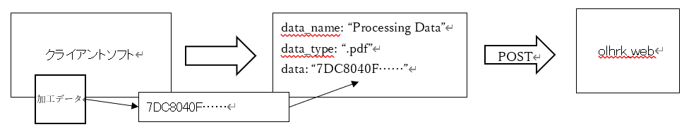

# HARUKA通信用モジュール

oldlclrは、実行中のHARUKAを制御するC#ライブラリです。HARUKAとのプロセス間通信を行います。
以下では公開クラス、メソッド、列挙型等の一覧とその説明を記載します。
一部クラスとメソッドはHARUKA側の利用で、クライアント側では使用を想定していません。

## モジュール仕様

### クラス一覧
|    |  クラス名  |  説明  |  クライアント側での使用頻度  |
| ---- | ---- | ---- | ---- |
|  1.  |  Client  |  HARUKAと通信を行います。  |  高  |
|  2.  |  Codec  |  データをJSON形式にエンコード/デコードする処理を管理します。  |  中  |
|  3.  |  Error  |  エラーを管理します。  |  高  |
|  4.  |  Receiver  |  使用しません。  |  -  |
|  5.  |  ReceiverHandler  |  使用しません。  |  -  |
|  6.  |  Service  |  使用しません。  |  -  |
|  7.  |  Status  |  HARUKAの状態を表します。当該データは、Setter、Getterを備えていますが、クライアント側で使用するには、煩雑な処理になります。  |  高  |
|  8.  |  Str  |  アンマネージドオブジェクトのバイト配列を管理します。  |  低  |

### 列挙型一覧
|    |  列挙型名  |  説明  |  クライアント側での使用頻度  |
| ---- | ---- | ---- | ---- |
|  1.  |  ErrorCode  |  oldlclr.Errorで得られるエラー番号と定数名の対応です。  |  高  |
|  2.  |  StatusCode  |  HARUKAの状態を表す定数名と番号の対応です。  |  高  |

### メソッド一覧

#### Clientクラス メソッド
|    |  メソッド名  |  説明  |  備考  |
| ---- | ---- | ---- | ---- |
|  1.  |  GetStatus  |  HARUKAの状態を取得します。  |  加工データの書式については後述します。  |
|  2.  |  LoadData  |  HARUKAに加工データを送ります。  |    |

#### Statusクラス メソッド
|    |  メソッド名  |  説明  |  備考  |
| ---- | ---- | ---- | ---- |
|  1.  |  ToJson  |  HARUKAの状態をJson形式の文字列で取得します。  |  加工データの書式については後述します。  |
|  2.  |  ToJsonStr  |  HARUKAの状態をアンマネージドオブジェクトのバイト配列として取得します。  |  加工データの書式については後述します。  |

#### Strクラス メソッド
|    |  メソッド名  |  説明  |  備考  |
| ---- | ---- | ---- | ---- |
|  1.  |  GetContentsAsString  |  アンマネージドオブジェクトのバイト配列をUTF8の文字列とみなして、UTF16文字列変換します。  |    |

#### Errorクラス メソッド
|    |  メソッド名  |  説明  |  備考  |
| ---- | ---- | ---- | ---- |
|  1.  |  GetError  |  HARUKAとの通信において、直前のエラー番号を返します。  |    |
|  2.  |  SetError  |  直前のエラー番号を設定します。  |  処理中でエラー値をクリアしたい場合に使用します。  |
|  3.  |  GetErrorAsJson  |  エラー番号をJsonで返します。  |  書式は後述します。  |

### 列挙型 定数一覧

#### ErrorCode 定数
|    |  定数名  |  値  |  説明  |
| ---- | ---- | ---- | ---- |
|  1.  |  NO_ERROR  |  0  |  エラーなし  |
|  2.  |  OUT_OF_MEMORY  |  -1  |  メモリーエラー  |
|  3.  |  INVALID_ARGS  |  -2  |  無効な引数  |
|  4.  |  CANT_ALLOCATE_FILE_DESC  |  -3  |  ファイルハンドルを生成できなかった  |
|  5.  |  FILE_DESC_CLOSED  |  -4  |  ファイルハンドルが閉じている  |
|  6.  |  WRONG_COMMAND_FORMAT  |  -5  |  コマンド書式が無効  |
|  7.  |  CANT_GENERATE_UNIQUE_ID  |  -6  |  データ通信用IDを生成できない  |
|  8.  |  CMD_NOT_ACCEPTABLE  |  -7  |  データ通信要求は受理されなかった  |
|  9.  |  NOT_COMMUNICATE  |  -8  |  通信できない  |
|  10.  |  UNEXPECTED_STATUS  |  -9  |  想定外の状態  |
|  11.  |  RECEIVER_IS_NOT_ATTACHED  |  -10  |  HARUKAと接続できない  |
|  12.  |  NOT_ACCEPT_DUPLICATE_COMMAND  |  -11  |  重複コマンドのため受理できない。  |
|  13.  |  INVALID_DATA_FORMAT  |  -12  |  無効なデータ書式  |
|  14.  |  RECEIVER_IS_BUSY  |  -13  |  HARUKAは処理がたまっているため応答できない  |

#### StatusCode 定数
|    |  定数名  |  値  |  説明  |
| ---- | ---- | ---- | ---- |
|  1.  |  Idle  |  0  |  特に処理を行っていない  |
|  2.  |  Processing  |  1  |  加工中  |
|  3.  |  Loading  |  2  |  読込中  |

### HARUKAの状態を表すJSON書式
|    |  名前  |  値の説明  |
| ---- | ---- | ---- |
|    |  data_name  |  HARUKAが現在ロードしているデータ名  |
|    |  processed_count  |  ロードしているデータの加工回数  |
|    |  status  |  HARUKAの状態(oldlclr.StatusCode)  |
|    |  finished_time_of_processing  |  加工を最後に終了した時間(yyyy-mm-dd hh-mm-ss)  |
|    |  finished_time_of_loading  |  データを読み込んだ時間(yyyy-mm-dd hh-mm-ss)  |

### HARUKAへのデータ書き込み書式
|    |  名前  |  値の説明  |
| ---- | ---- | ---- |
|  1.  |  data_name  |  HARUKAのメインウインドウに表示されるデータ名  |
|  2.  |  data_type  |  ロードするデータのタイプ(.pdf、.aiなど、’.’と拡張子の組み合わせ)  |
|  3.  |  data  |  加工データを16進数表記した文字列  |

#### データ形式
HARUKAに渡すデータは、16進数表記した文字列で渡します。

変換前のデータ
  <table class="data_format_table">
    <tr><td>番号</td><td>0</td><td>1</td><td>2</td><td>3</td></tr>
    <tr><td>データ</td><td>125</td><td>200</td><td>4</td><td>15</td></tr>
  </table>

↓

16進表記の文字列変換
  <table class="data_format_table">
    <tr><td>番号</td><td>0</td><td>1</td><td>2</td><td>3</td></tr>
    <tr><td>データ</td><td>7D</td><td>C8</td><td>04</td><td>0F</td></tr>
  </table>

加工データはJSON形式にデータ変換されたのちにHARUKAへ送信されます。olhrk_webでは図示のフローを経てREST APIにPOSTします。

[home.viewmodel.js](https://github.com/OHLASER/olhrk_web/blob/master/Scripts/app/home.viewmodel.js) .createSubmitDataが参考になります。

#### エラーを表すJSON書式
|    |  名前  |  値の説明  |
| ---- | ---- | ---- |
|  1.  |  error_code  |  エラー番号 (oldlclr.ErrorCodeを参照のこと)  |

